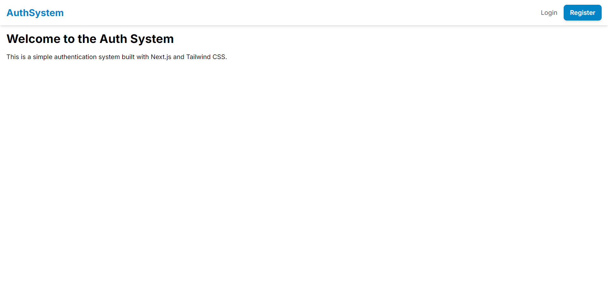
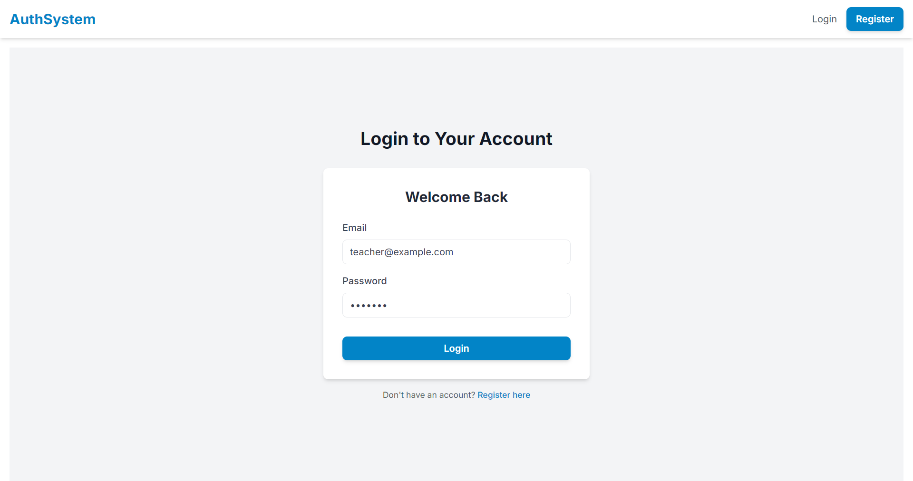
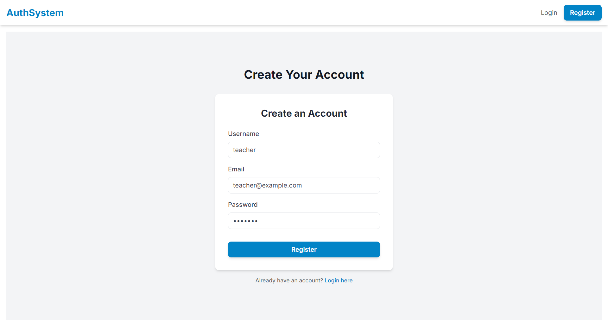
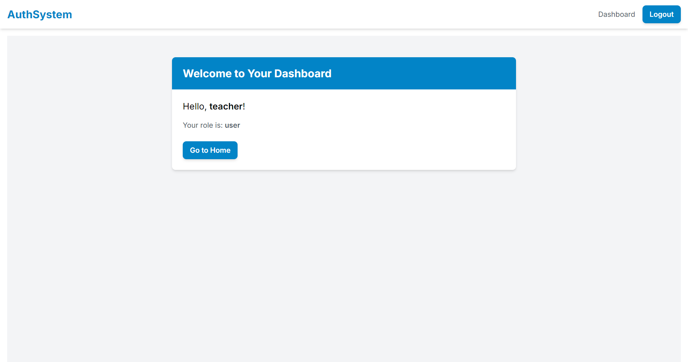
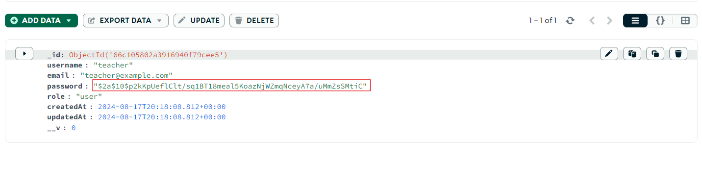

# Next.js Authentication System

A modern, secure, and user-friendly authentication system built with Next.js, Tailwind CSS, and MongoDB.



## Features

- User registration with email and password
- Secure login with JWT authentication
- Protected routes and role-based access control
- Responsive design optimized for both desktop and mobile
- Custom UI components for consistent styling
- Server-side rendering for improved performance and SEO

## 📸 Screenshots

### Login Page



### Registration Page



### Dashboard



## 🛠️ Technologies Used

- [Next.js](https://nextjs.org/) - React framework for server-side rendering and static site generation
- [Tailwind CSS](https://tailwindcss.com/) - Utility-first CSS framework
- [MongoDB](https://www.mongodb.com/) - NoSQL database
- [Mongoose](https://mongoosejs.com/) - MongoDB object modeling for Node.js
- [bcryptjs](https://github.com/dcodeIO/bcrypt.js/) - Password hashing
- [jsonwebtoken](https://github.com/auth0/node-jsonwebtoken) - JWT implementation

## 📋 Prerequisites

Before you begin, ensure you have the following installed:

- Node.js (v14 or later)
- npm or yarn
- MongoDB

## 🚀 Getting Started

1. Clone the repository:

```
git clone https://github.com/wassimOubaziz/PRODIGY_FS_01.git
```

2. Install dependencies:

```
npm install
```

or

```
yarn install
```

3. Set up environment variables:
   Create a `.env.local` file in the root directory and add the following:

```
MONGODB_URI=your_mongodb_connection_string
JWT_SECRET=your_jwt_secret_key
```

4. Run the development server:

```
npm run dev
```

or

```
yarn dev
```

5. Open [http://localhost:3000](http://localhost:3000) in your browser to see the application.

## 📁 Project Structure

```
src/
├── app/
│   ├── page.js
│   ├── layout.js
│   └── globals.css
├── pages/
│   ├── api/
│   │   └── auth/
│   │       ├── login.js
│   │       ├── register.js
│   │       └── logout.js
│   ├── login.js
│   ├── register.js
│   └── dashboard.js
├── components/
│   ├── Layout.js
│   ├── Navbar.js
│   ├── ClientNavbar.js
│   ├── AuthForm.js
│   ├── Button.js
│   └── Input.js
├── lib/
│   ├── mongodb.js
│   └── auth.js
├── models/
│   └── User.js
└── middleware/
└── authMiddleware.js
```

## 🔒 Authentication Flow

1. **Registration**: Users can create an account by providing a username, email, and password. Passwords are hashed using bcrypt before being stored in the database.



2. **Login**: Users can log in using their email and password. Upon successful authentication, a JWT token is generated and stored in the browser's local storage.

3. **Protected Routes**: Certain routes (e.g., dashboard) are protected and can only be accessed by authenticated users. The JWT token is used to verify the user's identity.

   

4. **Logout**: Users can log out, which removes the JWT token from local storage and redirects them to the login page.

## 🎨 UI Components

- `Button`: A reusable button component with consistent styling.
- `Input`: A styled input component for form fields.
- `AuthForm`: A flexible form component used for both login and registration.
- `Navbar`: A responsive navigation bar with dynamic content based on authentication status.

## 🔐 Security Considerations

- Passwords are hashed using bcrypt before storage.
- JWT tokens are used for maintaining user sessions.
- Protected routes are implemented using middleware to verify authentication.
- CORS is configured to restrict access to the API.
- Rate limiting is implemented to prevent brute-force attacks.

## 🚀 Deployment

This application can be easily deployed to platforms like Vercel or Netlify. Make sure to set up the required environment variables in your deployment platform.

## 🤝 Contributing

Contributions, issues, and feature requests are welcome! Feel free to check the [issues page](https://github.com/wassimOubaziz/PRODIGY_FS_01/issues).

## 📝 License

This project is [MIT](https://github.com/wassimOubaziz/PRODIGY_FS_01?tab=MIT-1-ov-file) licensed.

## 👤 Author

Wassim Oubaziz

- GitHub: [@wassimOubaziz](https://github.com/wassimOubaziz)
- LinkedIn: [wassim-oubaziz](https://www.linkedin.com/in/wassim-oubaziz/)

## 🙏 Acknowledgements

- [Next.js Documentation](https://nextjs.org/docs)
- [Tailwind CSS Documentation](https://tailwindcss.com/docs)
- [MongoDB Documentation](https://docs.mongodb.com/)
